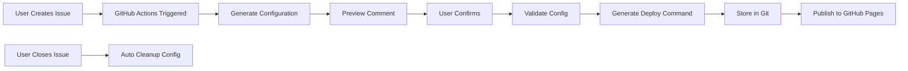

# 🚀 Kubernetes Component Deployment System

[](https://github.com/features/actions)
[](https://helm.sh/)
[](LICENSE)

A GitHub Issues-driven deployment system for Kubernetes components using Helm charts. Create deployments simply by opening GitHub Issues with an intuitive form interface.

## ✨ Features

- 📝 **Issue-Driven Deployments** - Deploy components by creating GitHub Issues
- 🎯 **Helm Integration** - Automated Helm chart deployment with Bitnami charts
- 🔄 **GitOps Workflow** - Configuration stored in Git branches
- ✅ **Validation & Testing** - Automatic configuration validation before deployment
- 🌐 **Web Interface** - GitHub Pages hosted deployment configurations
- 🤖 **Full Automation** - GitHub Actions powered CI/CD pipeline
- 🗑️ **Automatic Cleanup** - Configurations are cleaned when issues are closed
- 📌 **Persistent Storage** - Configurations remain available until manually closed

## 🏗️ Architecture



## 🚀 Quick Start

### Prerequisites

- GitHub repository with Actions enabled
- Kubernetes cluster (for actual deployment)
- Helm 3.x installed locally

### Setup

1. **Fork this repository**

2. **Enable GitHub Actions**
   ```bash
   Settings → Actions → General → Allow all actions
   ```

3. **Enable GitHub Pages** (optional)
   ```bash
   Settings → Pages → Source → Deploy from a branch → gh-pages
   ```

4. **Create your first deployment**
   - Go to Issues → New Issue
   - Select "Deploy Component" template
   - Fill in the form and submit

## 📦 Supported Components

| Component | Description | Chart |
|-----------|-------------|-------|
| `redis` | In-memory data store | [bitnami/redis](https://github.com/bitnami/charts/tree/main/bitnami/redis) |
| `mysql` | Relational database | [bitnami/mysql](https://github.com/bitnami/charts/tree/main/bitnami/mysql) |
| `postgresql` | Advanced SQL database | [bitnami/postgresql](https://github.com/bitnami/charts/tree/main/bitnami/postgresql) |
| `mongodb` | NoSQL document database | [bitnami/mongodb](https://github.com/bitnami/charts/tree/main/bitnami/mongodb) |
| `kafka` | Distributed streaming platform | [bitnami/kafka](https://github.com/bitnami/charts/tree/main/bitnami/kafka) |
| `elasticsearch` | Search and analytics engine | [bitnami/elasticsearch](https://github.com/bitnami/charts/tree/main/bitnami/elasticsearch) |
| `rabbitmq` | Message broker | [bitnami/rabbitmq](https://github.com/bitnami/charts/tree/main/bitnami/rabbitmq) |
| `nginx` | Web server | [bitnami/nginx](https://github.com/bitnami/charts/tree/main/bitnami/nginx) |

> 💡 Add more components by editing `component-charts.yaml`

## 📋 Workflow

### 1. Create Deployment Issue

Create a new issue with the following format:

```markdown
### 🎯 Component Type
redis

### 🏷️ Deployment Name  
my-app

### 🌐 Namespace
default

### 🏭 Environment
production

### ⚙️ Configuration (YAML)
\```yaml
auth:
  enabled: true
  password: "my-secret-password"
replica:
  replicaCount: 3
\```
```

### 2. Review Configuration Preview

The bot will comment with a deployment preview:

```markdown
🚀 Deployment Configuration Preview

Component: redis
Namespace: default
Name: redis-production

[✓] Confirm Deployment
[✓] Update Configuration Only
[✓] Cancel
```

### 3. Confirm Deployment

Check the "Confirm Deployment" checkbox and save the comment. The system will:

1. Validate your configuration
2. Generate deployment commands
3. Store configuration in `deployment-configs` branch
4. Publish to GitHub Pages
5. Keep the issue open for your reference

### 4. Deploy to Kubernetes

Use the generated command to deploy:

```bash
helm upgrade --install redis-production \
  oci://registry-1.docker.io/bitnamicharts/redis \
  --namespace default \
  --create-namespace \
  --atomic \
  --timeout 10m \
  --wait \
  --values https://your-domain/deployments/123/values.yaml
```

### 5. Lifecycle Management

- **Issue remains open** - Continue discussions, adjustments, or monitoring
- **Close when ready** - Closing the issue automatically cleans up configurations
- **Configurations persist** - No automatic expiration, configs stay until issue is closed

## 🔧 Configuration

### Component Mapping

Edit `component-charts.yaml` to add or modify components:

```yaml
components:
  your-component:
    chart: oci://your-registry/your-chart
    description: Your component description
```

### Workflow Customization

All workflows are in `.github/workflows/`:

- `issue-opened.yml` - Handles new deployment issues
- `issue-comment-edited.yml` - Processes deployment confirmations
- `deploy-helm-chart.yml` - Validates and generates deployment commands
- `build-gh-pages.yml` - Publishes configurations to GitHub Pages
- `issue-closed.yml` - Cleans up configurations when issues are closed

## 📊 Status Labels

| Label | Description |
|-------|-------------|
| `deployment-preview` | Configuration preview generated |
| `processing` | Deployment in progress |
| `validation-passed` | Configuration validated successfully |
| `validation-failed` | Configuration validation failed |
| `command-generated` | Deployment command ready |
| `deployed-successfully` | Deployment completed |
| `deployment-cancelled` | Deployment cancelled by user |
| `archived` | Issue closed and configuration cleaned |

## 🔒 Security

- Configurations are validated before deployment
- Sensitive data should be managed via Kubernetes secrets
- Use GitHub Secrets for cluster credentials
- All deployments are tracked and auditable

## 🤝 Contributing

1. Fork the repository
2. Create a feature branch (`git checkout -b feature/amazing-feature`)
3. Commit your changes (`git commit -m 'Add amazing feature'`)
4. Push to the branch (`git push origin feature/amazing-feature`)
5. Open a Pull Request

## 📝 License

This project is licensed under the Apache License 2.0 - see the [LICENSE](LICENSE) file for details.

## 🙏 Acknowledgments

- [Bitnami](https://bitnami.com/) for excellent Helm charts
- [GitHub Actions](https://github.com/features/actions) for automation
- [Helm](https://helm.sh/) for Kubernetes package management

## 📞 Support

- 📧 Create an [Issue](https://github.com/because-of-you/component/issues)
- 💬 Start a [Discussion](https://github.com/because-of-you/component/discussions)
- 📖 Check the [Wiki](https://github.com/because-of-you/component/wiki)

---

<div align="center">
  Made with ❤️ using GitHub Actions and Helm
</div>